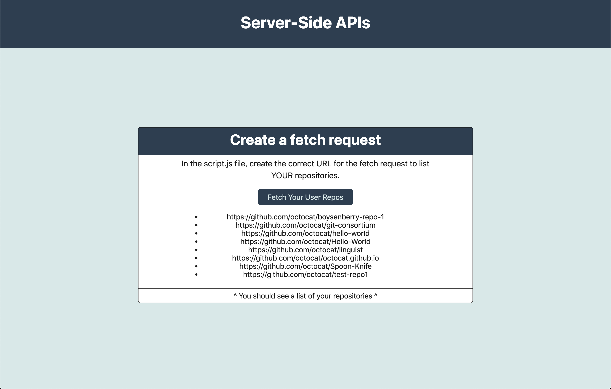

# Implement a fetch() Request to Display User Repositories

## Functionality:

when I click the "Fetch Your User Repos" button, a list of my GitHub repositories gets displayed on the page.

<a href="">Link to the deployed app</a>

The aim of this project is to practice working with server side APIs and the fetch() request. I am using the <a href="https://docs.github.com/en/rest/reference/repos#list-repositories-for-a-user">github API</a> to get a list of my repos (see part: List repositories for a user).

### Mockup:

